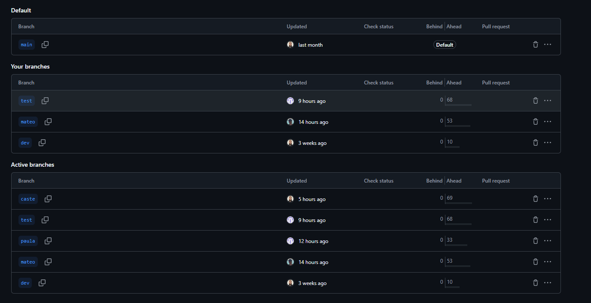
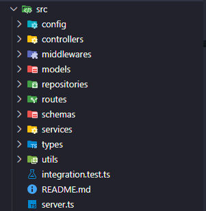

# Presentación - Metodologia de Sistemas II

## Sistema Integral de Gestión de Negocio 
**Integrantes:** *Santiago Castellaro, Mateo Muscolino, Paula General*

---

## Introducción

El presente documento expone cómo el proyecto **Sistema Integral de Gestión de Negocio** aplica los contenidos teóricos y prácticos trabajados durante la cursada de **Metodología de Sistemas II**.

El sistema desarrollado incluye autenticación (login/logout), acceso con roles (admin/empleado) y gestión completa de **productos, categorías y ventas**, integrando buenas prácticas, principios de diseño, metodologías de desarrollo y control de calidad.

El objetivo principal es permitir y agilizar el control de stock y ventas de manera eficiente y amigable, adaptándose a cualquier tamaño de empresa con mínima capacitación del personal.

---

## 1. Nombres y Formato de Variables

Se aplicaron convenciones de nombres para garantizar legibilidad y consistencia en todo el código.

### Justificación
- Se utilizaron nombres **descriptivos** para revelar la intención del código sin necesidad de comentarios excesivos.
- Se adoptó el idioma **inglés** como estándar de la industria.
- **CamelCase** para variables y funciones (JS/React).
- **PascalCase** para Componentes y Clases.
- **Kebab-case** o nombres descriptivos para archivos, manteniendo la cohesión.

### Ejemplos del Proyecto:
- **Variables:** `user`, `isLoggedIn`, `validateData`, `totalAmount`.
- **Archivos:** `auth.controller.js`, `Product.js`, `EditProductModal.jsx`.

---

## 2. Uso de Constantes

### Justificación
Las constantes se definieron en mayúsculas (`UPPER_SNAKE_CASE`) para evitar "números mágicos" o cadenas de texto hardcodeadas en la lógica del negocio. Esto facilita el mantenimiento: si un valor cambia, solo se modifica en un lugar.

### Ejemplos:
- **Variables de Entorno:** `MONGO_URI`, `PORT`, `JWT_SECRET`.
- **Configuraciones:** `MAX_LOGIN_ATTEMPTS`, `TAX_RATE`.

---

## 3. Funciones y Principio de Responsabilidad Única (SRP)

Se buscó que cada función cumpla con una tarea específica y atómica.

### Justificación
- **Modularidad:** Facilita la reutilización de código en diferentes partes del sistema (ej: componentes de UI reutilizables).
- **Legibilidad:** Funciones cortas permiten entender la lógica rápidamente.
- **Testabilidad:** Al tener una única responsabilidad, es más fácil escribir tests unitarios para esa función.

### Ejemplos del Proyecto:
- **Backend:** La función `getSaleItems` Su única responsabilidad es dirigir la obtención de datos, sin mezclar lógica de negocio compleja ni consultas SQL/Mongo directas.

```javascript
// Obtener detalle de una venta especifica
export const getSaleDetail = async (req: Request, res: Response) => {
  try {
    const saleRepository = new SaleRepository(); // 1. Instancia la capa de datos
    const { id } = req.params;

    // 2. Validación simple de entrada
    if (!id) {
      return res.status(400).json({ message: "El ID de venta es requerido" });
    }

    // 3. Delegación de la búsqueda al Repositorio (SRP)
    const sale = await saleRepository.findById(id);

    // 4. Retorno de respuesta estandarizada
    if (!sale) {
      return res.status(404).json({ message: "Venta no encontrada" });
    }

    return res.status(200).json({
      message: "Detalle de venta obtenido",
      sale: sale,
    });
  } catch (err) {
    console.error("Get sale detail error", err);
    return res.status(500).json({ message: "Error del servidor" });
  }
};
```

---

## 4. Manejo de Errores y Excepciones

Implementamos una estrategia de **programación defensiva** y manejo de excepciones estructurado para garantizar la estabilidad del sistema y brindar feedback claro.

### Justificación
- **Códigos de Estado HTTP Correctos:** Diferenciamos entre errores del cliente (`400 Bad Request`, `404 Not Found`) y errores del servidor (`500 Internal Server Error`).
- **Validaciones de Negocio:** Se validan condiciones críticas (como stock insuficiente) antes de intentar escribir en la base de datos.
- **Captura de Excepciones (Try-Catch):** Envolvemos la lógica asíncrona para evitar que el servidor se detenga ante un error inesperado.

### Ejemplos del Proyecto:
En el controlador `createSale`, vemos cómo se gestionan distintos escenarios de fallo: validación de stock (negocio) y captura de errores de validación de esquemas (Zod) dentro del bloque `catch`.

```typescript
export const createSale = async (req: Request, res: Response) => {
  try {
    // ... lógica de obtención de producto ...

    // 1. Manejo de Error de Negocio (Validación de Stock)
    if (product.stock < detail.amountSold) {
      // Se devuelve un 400 con un mensaje específico para el usuario
      return res.status(400).json({
        message: `Stock insuficiente para ${product.name}. Disponible: ${product.stock}`,
      });
    }

    // ... lógica de guardado ...

  } catch (err) {
    console.error("Create sale error", err);

    // 2. Manejo de Excepciones Específicas (ej. Error de validación Zod)
    if (err instanceof Error && err.message.includes("ZodError")) {
      return res.status(400).json({ message: "Datos de venta inválidos" });
    }

    // 3. Fallback para errores no controlados (Error 500)
    return res.status(500).json({ message: "Error interno del servidor" });
  }
};
```
---

## 5. Comentarios y Documentación

Se adoptó la filosofía de "Clean Code" donde el código debe explicarse a sí mismo, reservando los comentarios para decisiones complejas.

### Justificación
- Se evitaron comentarios redundantes que explican *qué* hace el código (ej: `// Suma 1`).
- Se priorizaron comentarios que explican el *por qué* de una decisión de negocio o lógica compleja.
- Se eliminó el código comentado (código muerto) antes de la versión final.

### Ejemplos:
- Documentación de parámetros en funciones críticas de autenticación.
- Comentarios explicativos en expresiones regulares (Regex) para validación de emails.

---

## 6. Control de Versiones y Flujo de Trabajo (Git)

Utilizamos Git como herramienta de control de versiones, implementando una estrategia de ramificación que nos permitió trabajar en paralelo sin conflictos bloqueantes.

### Estrategia de Ramas (Branching Strategy)
Observando nuestro flujo de trabajo, organizamos el repositorio en tres niveles:

1.  **Ramas Personales (`mateo`, `paula`, `caste`):**
    -   Cada integrante del equipo dispuso de su propia rama ("sandbox") para desarrollar funcionalidades y probar código libremente sin afectar al resto.

2.  **Ramas de Entorno (`dev`, `test`):**
    -   **`dev` (Development):** Rama de integración principal donde se unifica el trabajo de todos los desarrolladores.
    -   **`test`:** Rama utilizada para pruebas específicas antes de considerar el código listo para producción.

3.  **Rama Principal (`main`):**
    -   Contiene únicamente la versión estable y funcional del producto, lista para la entrega final.

### Justificación
Esta estructura nos permitió:
-   **Aislar errores:** Si una funcionalidad de un integrante fallaba, no rompía el entorno de desarrollo (`dev`) del resto del equipo.
-   **Revisión de código:** Facilitó la integración controlada mediante *Pull Requests* o *Merges* desde las ramas personales hacia `dev`.

### Evidencia del Proyecto:
A continuación se observa el estado de las ramas activas en el repositorio, mostrando el trabajo paralelo de los integrantes y las ramas de estabilización.



---

## 7. Patrón MVC (Modelo-Vista-Controlador)

El proyecto se estructuró siguiendo el patrón MVC, adaptado a una arquitectura web moderna (Cliente-Servidor), para separar claramente la lógica de negocio, la interfaz de usuario y los datos.

### Justificación
- **Desacoplamiento:** Permite trabajar en la interfaz gráfica (React) sin afectar la lógica del servidor (Node/Express).
- **Mantenibilidad:** Facilita la detección de errores. Si falla un cálculo, revisamos el Controlador; si falla un dato, el Modelo; si falla la visualización, la Vista.
- **Escalabilidad:** Permite que podamos trabajar en el Frontend y Backend en paralelo.

### Ejemplos del Proyecto:
- **Modelo (Model):** Definido en la carpeta `/schemas` y `/models`. Representa la estructura de los datos y las reglas de validación en MongoDB (ej: `Sale.schema.ts`, `Product.js`).
- **Vista (View):** El Frontend desarrollado en React. Los componentes (ej: `ProductManager.tsx`, `CategoriesManager.tsx`) actúan como la vista que consume los datos JSON y los presenta al usuario.
- **Controlador (Controller):** Ubicados en `/controllers`. Reciben las peticiones HTTP, validan la entrada y orquestan la respuesta (ej: `product.controller.ts`).


---

## 8. Patrón de Diseño: Repository (Repositorio)

Implementamos el patrón Repository para crear una capa de abstracción entre la lógica de negocio (Controladores) y la capa de acceso a datos (Base de Datos).

### Justificación
- **Abstracción:** Los controladores no contienen consultas complejas a la base de datos (queries de Mongoose), lo que mantiene el código limpio.
- **Centralización:** Si la lógica de acceso a datos cambia (ej: optimización de una consulta), solo se modifica el repositorio y no todos los controladores.
- **Testabilidad:** Facilita las pruebas unitarias al permitir "mockear" (simular) el repositorio sin conectar a la base de datos real.

### Ejemplos del Proyecto:
En el controlador de ventas, no se interactúa directamente con el modelo de Mongoose, sino que se instancia `SaleRepository`.

```typescript
// Fragmento de sale.controller.ts
export const getSaleDetail = async (req: Request, res: Response) => {
    // Instanciamos el repositorio (Capa de abstracción)
    const saleRepository = new SaleRepository();
    
    // El controlador pide datos, sin preocuparse por CÓMO se obtienen
    const sale = await saleRepository.findById(id); 
    
    // ...
};
```
---
## 9. Patrón de Diseño: Singleton

Se utilizó el patrón Singleton para garantizar una instancia única en la gestión de recursos compartidos, específicamente en la conexión a la base de datos y la instancia del servidor.

### Justificación
- **Eficiencia de Recursos:** La conexión a la base de datos se establece una sola vez al iniciar la aplicación (`server.ts`).
- **Estado Global Compartido:** Node.js cachea los módulos; sin embargo, asegurar que la llamada a la base de datos ocurra solo en el arranque evita la sobrecarga de crear múltiples pools de conexión innecesarios con cada petición HTTP.
- **Instancia del Servidor:** La variable `app` (Express) actúa como una instancia única que centraliza la configuración de middlewares y rutas.

### Ejemplos del Proyecto:
En el archivo principal `server.ts`, invocamos el método `connect()` antes de iniciar el servidor. Esta conexión permanece viva y es reutilizada por todos los modelos y controladores durante el ciclo de vida de la aplicación.

```typescript
// Fragmento de server.ts
// ... imports

// Cargar variables de entorno
dotenv.config();
const { connect } = require('./config/db');

// 1. Inicialización Única (Singleton)
// Se conecta a la BD una sola vez al arrancar el proceso.
connect().catch((err: Error) => {
  console.error('DB connection error:', err.message);
  process.exit(1);
});

// crear app express
const app = express();

// ... configuración de middlewares y rutas ...

// iniciar servidor
app.listen(PORT, () => {
  console.log('Server running in PORT:', PORT);
});
```

---

## 10. Arquitectura del Proyecto

El sistema se diseñó siguiendo una separación de responsabilidades para asegurar la escalabilidad.

### Estructura General
1. **Frontend (Cliente):** SPA desarrollada en React. Se comunica con el servidor mediante peticiones HTTP (REST).
2. **Backend (Servidor):** API RESTful (Node/Express) que procesa la lógica y conecta con la base de datos.
3. **Base de Datos:** MongoDB para el almacenamiento flexible de productos y ventas.

### Organización de Carpetas (Backend)
- `/controllers`: Lógica de las peticiones.
- `/models`: Esquemas de datos (Mongoose).
- `/routes`: Definición de endpoints.
- `/middleware`: Validaciones previas (Autenticación).


> 
> *Fig 4. Estructura de carpetas del proyecto backend.*